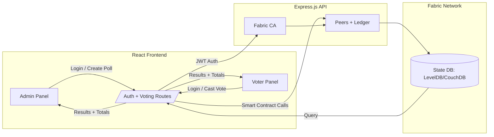
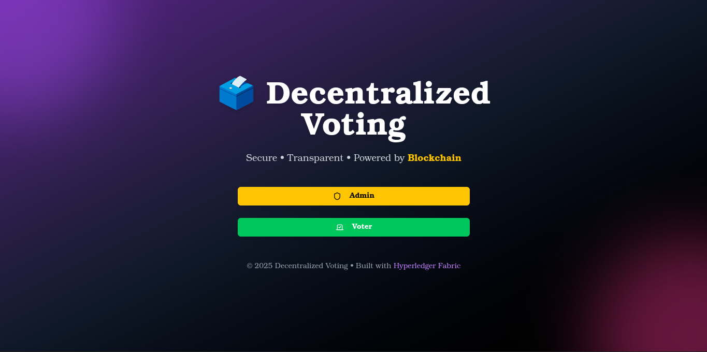
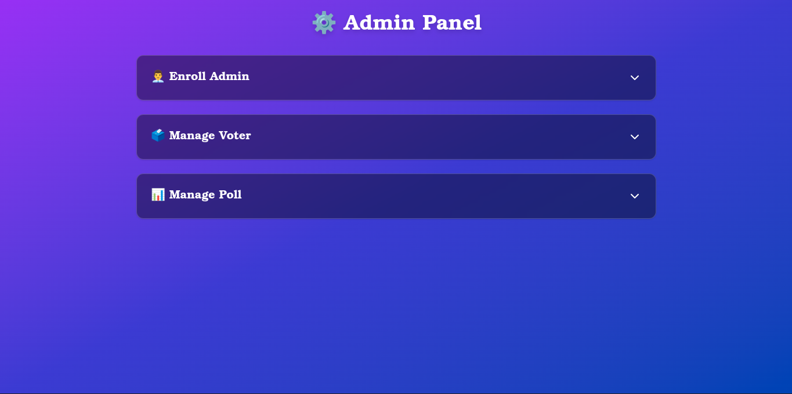
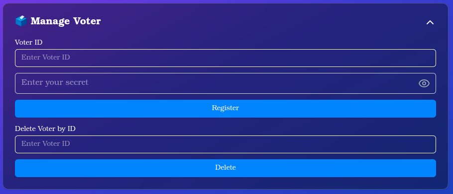
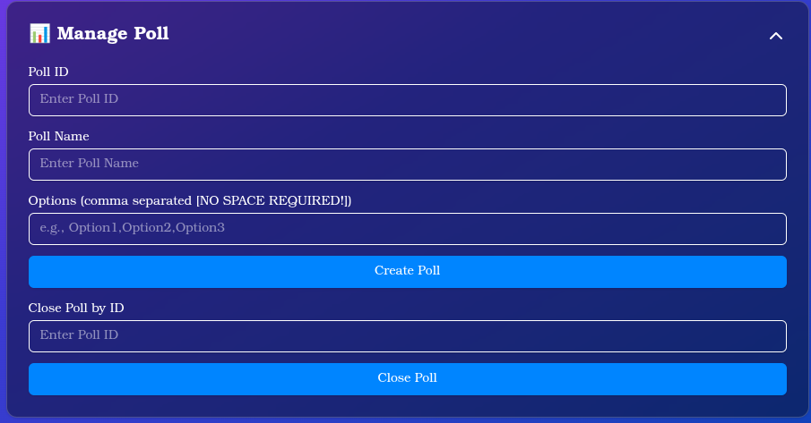
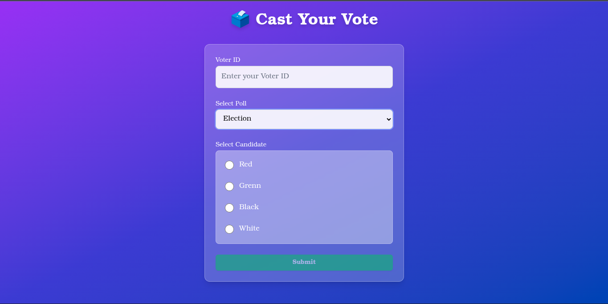
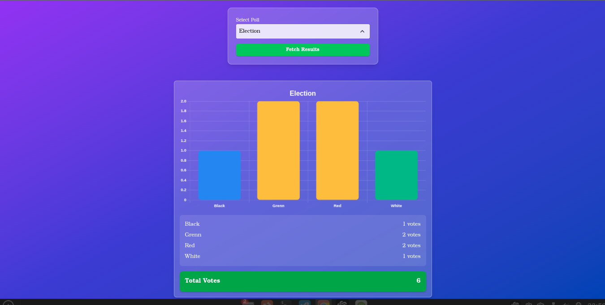

# 🗳️ Decentralized Voting System (Blockchain + Hyperledger Fabric)

> A secure, transparent, and tamper-proof voting platform powered by **Hyperledger Fabric**, **Express.js**, and **React**.  
> Ensures only authenticated voters can cast votes and results are immutable on the blockchain.

---

## ✨ Features

- 👩‍💼 **Admin Panel**
  - Secure login with JWT (access + refresh tokens)
  - Enroll admin with Fabric CA
  - Register & delete voters
  - Create and close polls
  - View poll results with **total votes**

- 🧑‍🤝‍🧑 **Voter Side**
  - Secure login (Fabric identity)
  - Cast votes securely
  - Prevents double voting
  - View poll questions & results

- 🔐 **Security**
  - Fabric CA for identity management
  - JWT authentication & refresh tokens
  - Access control (Admin vs Voter)
  - Immutable ledger storage (Hyperledger Fabric)

- 📊 **UI / UX**
  - Responsive React frontend
  - Scrollable results page with totals
  - Popup feedback for success/errors
  - Auto token refresh + re-login flow

---

## 🏗️ System Architecture


---
# ⚙️ Tech Stack
## Frontend

- React (Vite)

- Axios (API calls)

- TailwindCSS / ShadCN UI

- JWT handling with Axios interceptors

## Backend

- Node.js + Express

- JSON Web Tokens (JWT + Refresh tokens)

- Fabric SDK for Node.js

- dotenv, cors, body-parser

## Blockchain

- Hyperledger Fabric (CA, Peers, Ordering Service)

- LevelDB / CouchDB (state database)

---
# 📂 Repository Structure
```bash
📦 decentralized-voting
 ┣ 📂 backend    # Express.js + Fabric SDK
 ┣ 📂 frontend   # React + Vite client
 ┣ 📜 README.md
 ┗ 📜 package.json
```

# 🚀 Getting Started
## 1. Prerequisites

- Node.js (v18+ recommended)

- npm or yarn

## Running Hyperledger Fabric network (CA, peer, orderer)

>👉 Fabric setup is not included here.
Check out my separate repo for Fabric samples and setup guide:
[Fabric Network Setup](https://github.com/IoT-Security-Using-Blockchain/Secure-IoMT-Edge-Data-via-Hyperledger-Fabric)

## 2. Clone this Repository
```bash
git clone https://github.com/yourusername/Decentralized-Voting-System.git
cd decentralized-voting
```

## 3. Backend Setup
```bash
cd backend
npm install

# Start backend server
node server.js
```

> By default, it runs at:
👉 http://localhost:5000


## 4. Frontend Setup
```bash
cd frontend
npm install

# Start frontend client
npm run dev
```
>By default, it runs at:
👉 http://localhost:5173


## 5. Environment Variables
Both the backend and frontend require .env files.

- Backend (/backend/.env)
Contains configuration such as:

    - API port

    - Fabric CA admin ID & secret

    - JWT secrets for access & refresh tokens

- Frontend (/frontend/.env)
Contains configuration such as:

    - API endpoints (auth & voting service URLs)

> ⚠️ Important: Do not share your actual secrets publicly.
Instead, create .env.example files in both folders to show the required keys (without values).


Example:
```bash
# backend/.env.example
PORT=
CA_ADMIN_ID=
CA_ADMIN_SECRET=
JWT_SECRET=
REFRESH_SECRET=

# frontend/.env.example
VITE_API_URL_AUTH=
VITE_API_URL_VOTING=
```
---
# 📜 Usage Flow

- Admin Login

    - Admin logs in using the configured CA_ADMIN_SECRET.

    - Receives JWT access + refresh tokens.

- Enroll Admin

    - Admin identity is enrolled via Fabric CA.

- Register Voter

    - Admin registers new voters (Fabric CA issues certificate).

- Create Poll

    - Admin creates a poll with question + options.

- Cast Vote

    - Voter logs in and submits vote.

    - Transaction is written immutably to Fabric ledger.

- Fetch Results

    - Admin queries results.

    - Ledger returns votes + total count.


---
# 📷 Screenshots
### 🏠 Home Screen


### 🔐 Admin-Panel Screen


### 🤵 Voter-Register Screen


### 🧰 Poll-Create Screen


### 🗳️ Voting Screen


### 📊 Results Screen



## 📸 Preview


## 🎥 Full Demo Video
Watch the full demo here: [Google Drive Link](https://drive.google.com/file/d/17pEga6gqFXqfSg8XdkiVt4gTErv0jJkf/view?usp=drive_link)


# 📌 Roadmap

-  Real-time vote updates (WebSockets)

- Hyperledger Explorer integration

- Mobile app (React Native)

---
# 🛡️ Security Highlights

- Only registered Fabric identities can vote

- JWT tokens protect backend APIs

- Refresh tokens extend secure sessions

- Immutable ledger ensures auditability

- No duplicate Voting available

- Poll results and no further Vote only after Admin Closes the Poll

--- 
# 🤝 Contributing

### Pull requests are welcome! For major changes, open an issue first.

# 📝 License
***This project is licensed under the Apache License 2.0 - see the [LICENSE](LICENSE) file for details.***